# GSK_Robot_Sys

## 介绍

本项目设计一个工业机器人控制系统（手持示教器），包括界面设计、机器人控制语言解释器、插补算法等等。项目目前包含以下部分：

 - MFC 框架显示库 —— 是一个基于 MFC 的工业机器人模拟器（RoboSim），运行在 Windows 平台，支持 scara、delta、puma 模型。
 - GRS_Pro —— 目前包含 GR_HMI、GRS_Core、robDecodePrg 三个部分。其中是 GR_HMI 是基于 Qt 设计的界面，GRS_Core 是系统的核心和通用模块，robDecodePrg 是控制语言解释器模块。

## 启动程序

RoboSim 与 GRS_Pro 之间通过共享内存进行通信，并且目前设计为由 RoboSim 创建共享内存，因此需要先启动 RoboSim，再启动 GR_HMI 界面部分。

控制器主界面：

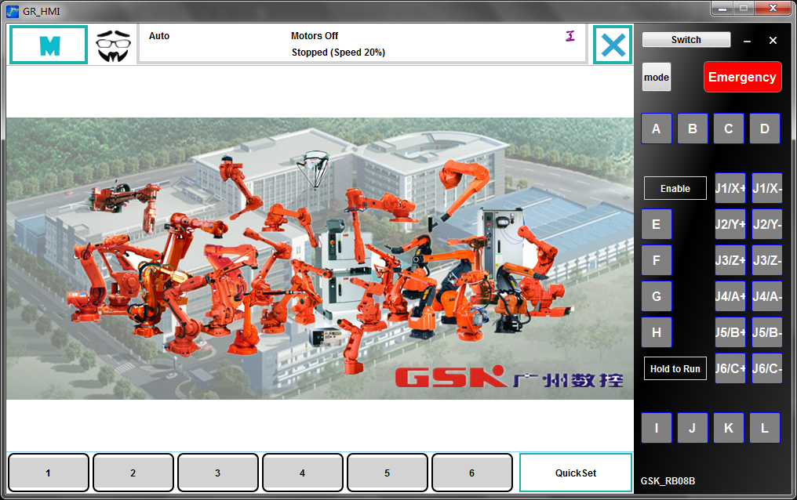

点击右侧控制面板的“Switch”按钮，可以隐藏显示窗口：

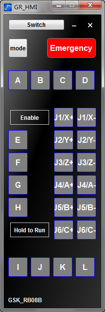

菜单功能：

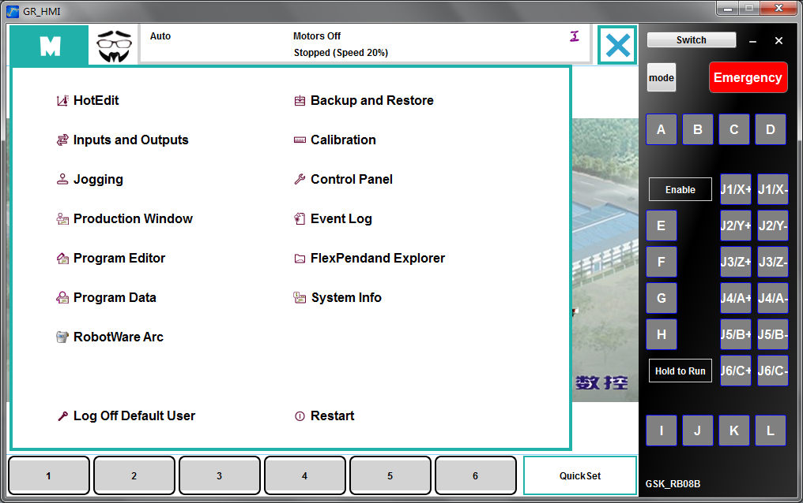

Jogging 手动控制界面：

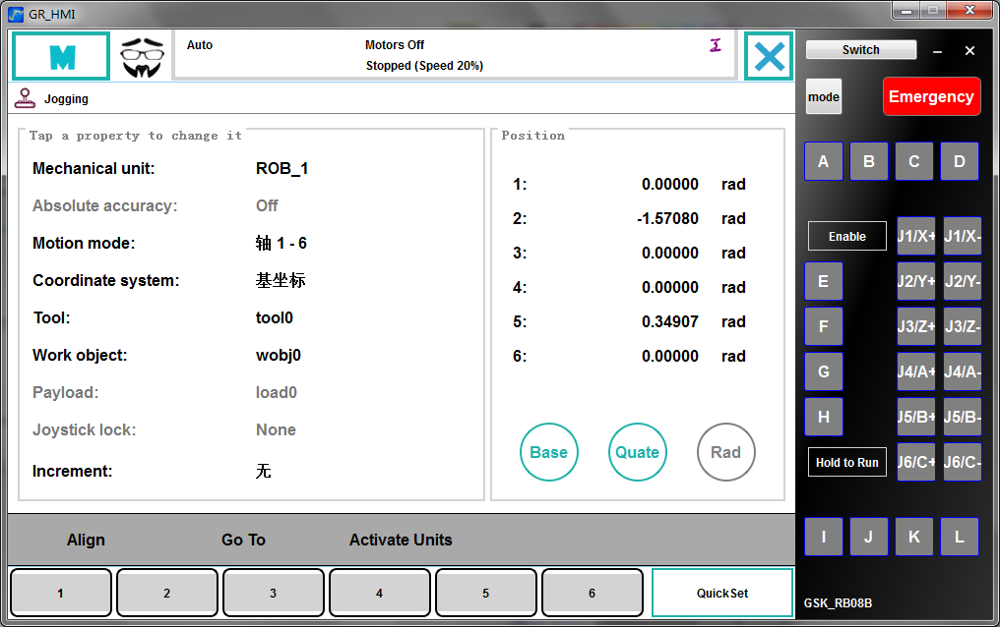

切换运动模式界面：

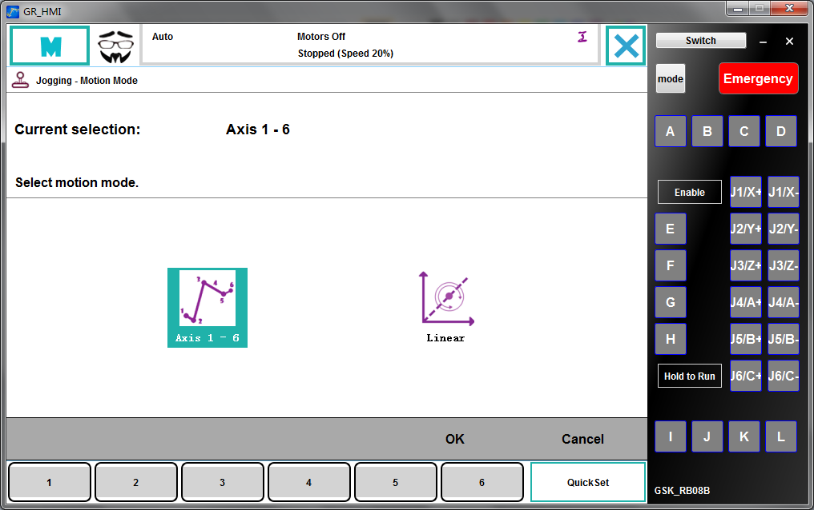

切换坐标界面：

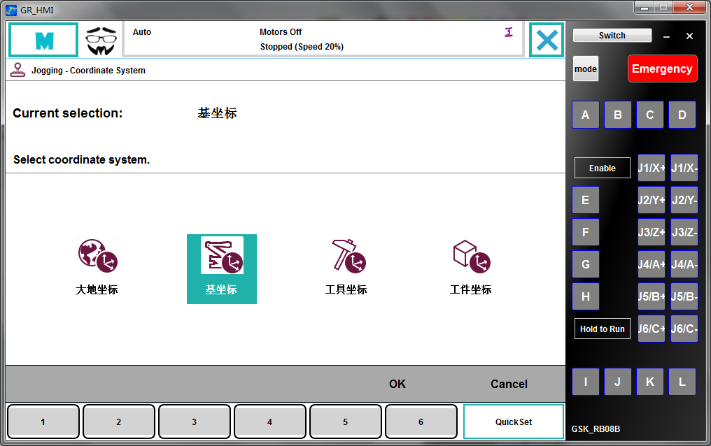

增量设置界面：

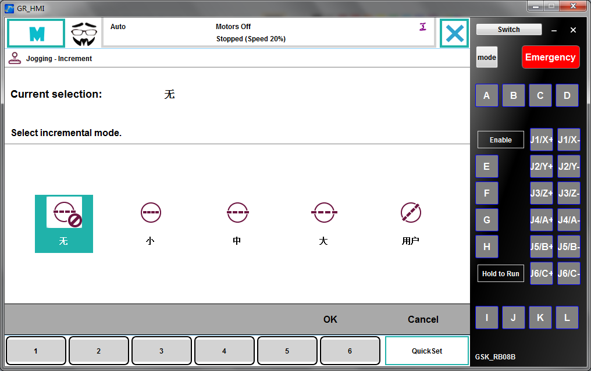

Align 界面：

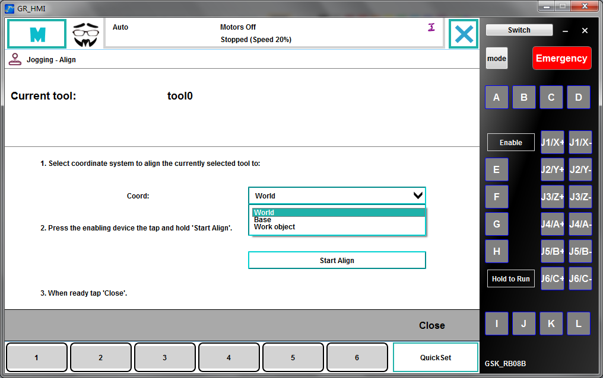

实时显示机械臂当前的位置姿态坐标，支持 Quate 和 Euler 转换，支持角度和弧度：

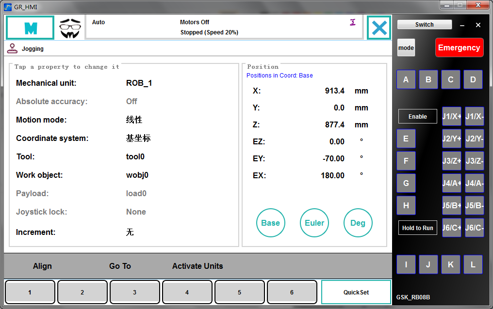

对机械臂进行示教，需要选择手动控制模式，并按下右侧面板的“Enable”按钮：

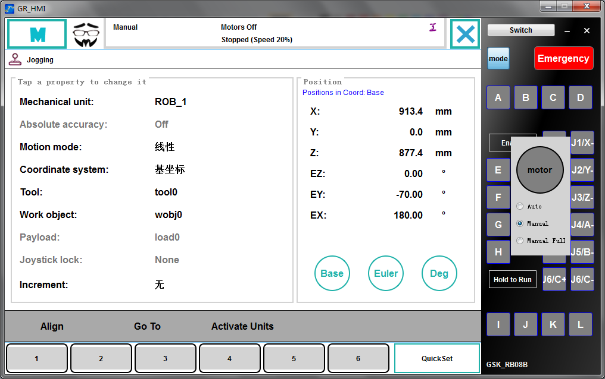

结合 RoboSim 进行模拟：

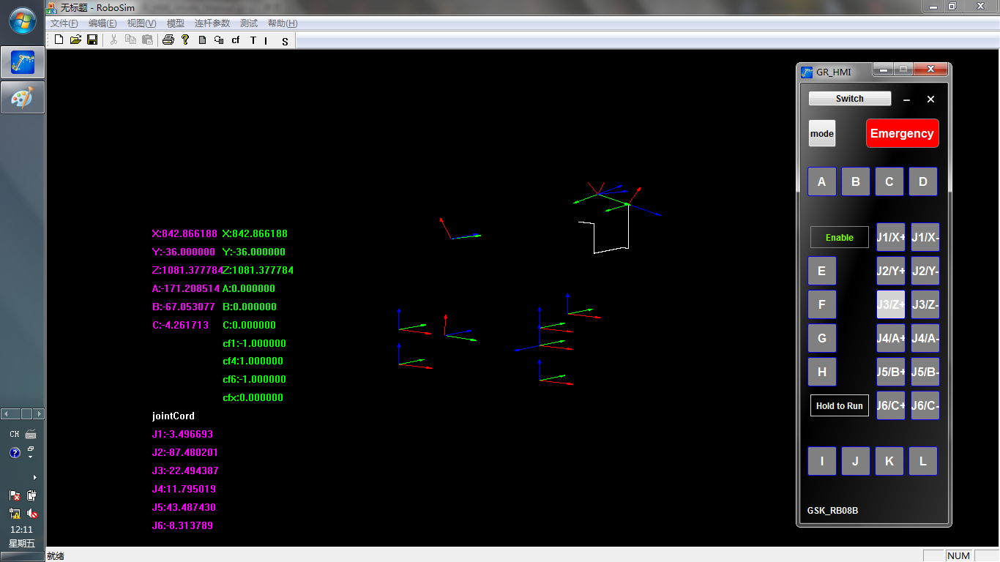
